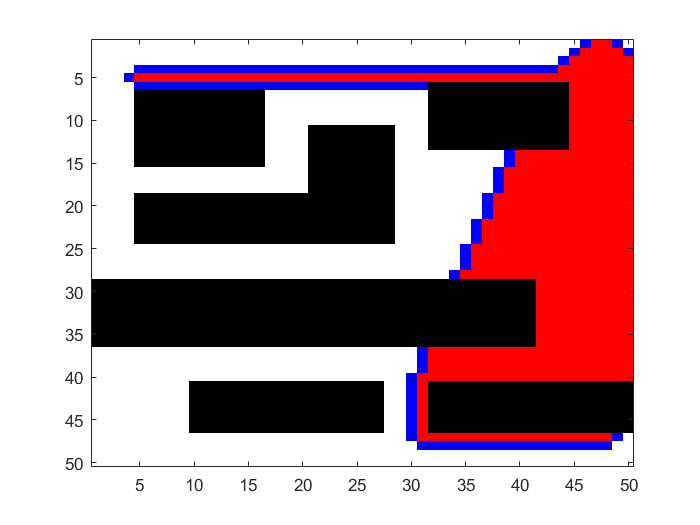
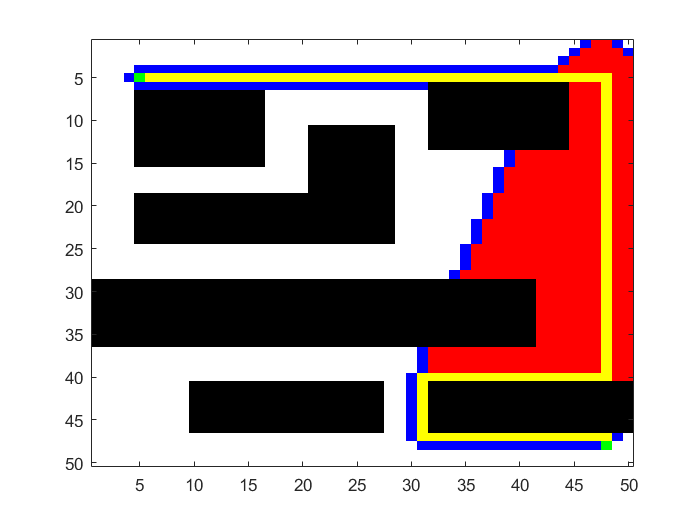

# build  
1. open a new terminal in aStarTx2Build folder and type:  
`cmake .`  
2. then type:  
`make`  
3. to run this program type:  
`./astar [sourcename.bmp] [reultname.bmp] [points.txt]`  
or type:  
`./astar -h`  
for help  
# results  
* original map  

    
	  
 

   
* search progress  

    
	  
 

   
* search result  

    
	  
 

 
 
notice: c++ and matlab have different results due to different sort methods  

    
	  
 

 
   
* execution time comparasion  
  
    
	  
 

  
  
    
	  
 

  
# distros  
1. matlab 32ms (20210311)  
2. c++ (windows)  6(4)ms (20210311)  
3. c++ (tx2)  
# references  
[教程-segmentfault](https://segmentfault.com/a/1190000017839112)  
[参考-维基百科-A*搜尋演算法](https://zh.wikipedia.org/wiki/A*%E6%90%9C%E5%B0%8B%E6%BC%94%E7%AE%97%E6%B3%95)  
[参考-维基百科-广度优先搜索](https://zh.wikipedia.org/wiki/%E5%B9%BF%E5%BA%A6%E4%BC%98%E5%85%88%E6%90%9C%E7%B4%A2)  

 