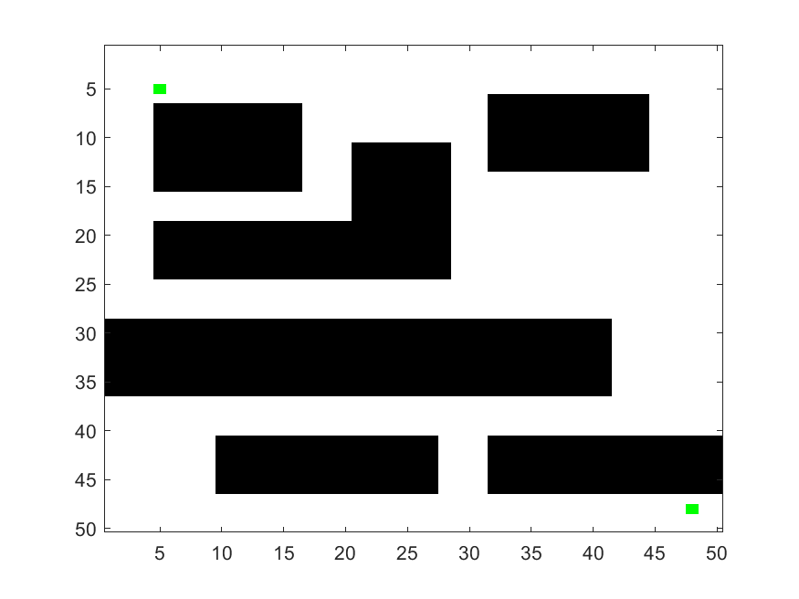
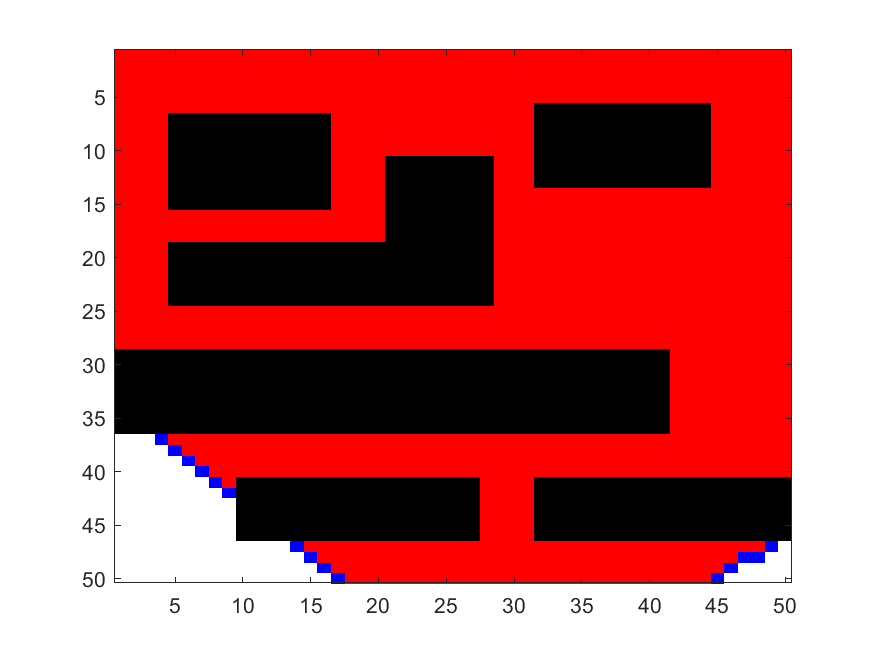
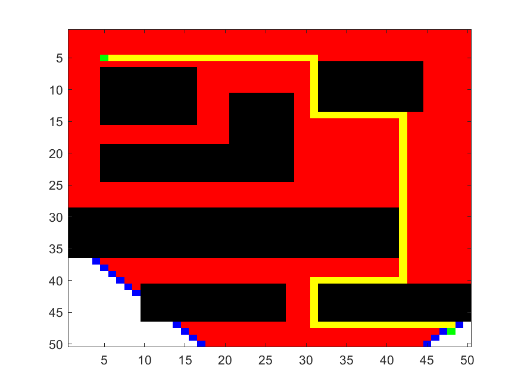
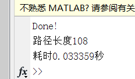
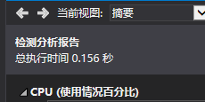

# results  
* original map  

    
	  
 

   
* search progress  

    
	  
 

   
* search result  

    
	  
 

  
* execution time comparasion  
  
    
	  
 

  
  
    
	  
 

  
# distros   
1.matlab 33ms (20210311)  
2.c++  156ms (20210309)  
# references  
[教程-知乎](https://zhuanlan.zhihu.com/p/51112799)  
[参考-维基百科-戴克斯特拉算法](https://zh.wikipedia.org/wiki/%E6%88%B4%E5%85%8B%E6%96%AF%E7%89%B9%E6%8B%89%E7%AE%97%E6%B3%95)  
[参考-维基百科-广度优先搜索](https://zh.wikipedia.org/wiki/%E5%B9%BF%E5%BA%A6%E4%BC%98%E5%85%88%E6%90%9C%E7%B4%A2)  

 