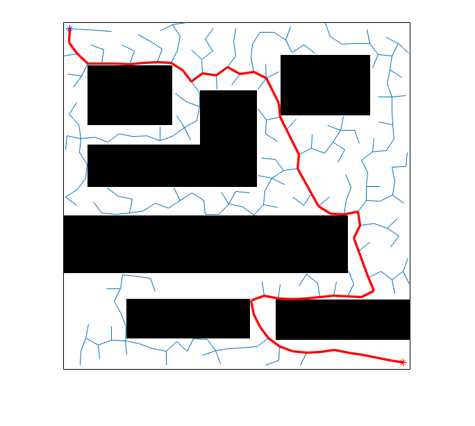
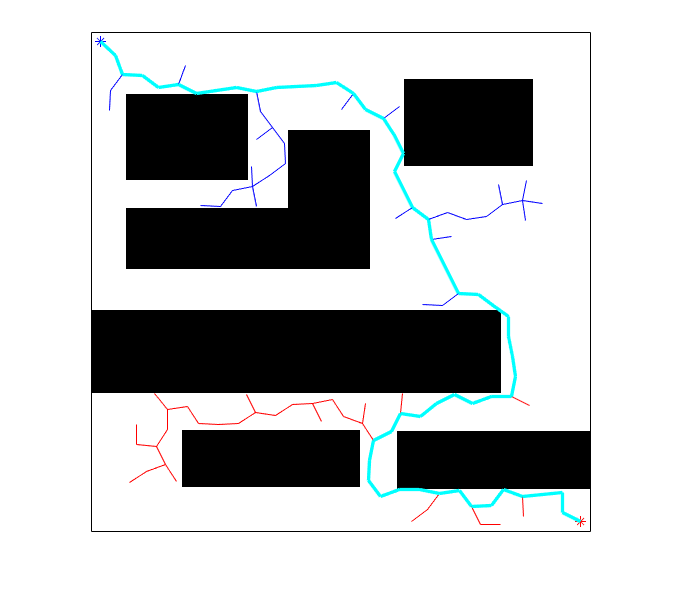

# results  
* single direction search  

    
	  
 

   
* dual direction search  

    
	  
 

   
# references  
[教程-博客园](https://www.cnblogs.com/21207-iHome/p/7210543.html)  
[参考代码-单向-印度信息工程学院](http://rkala.in/codes/RRT.zip)  
[参考代码-双向-印度信息工程学院](http://rkala.in/codes/bidirectional%20RRT.zip)  

 