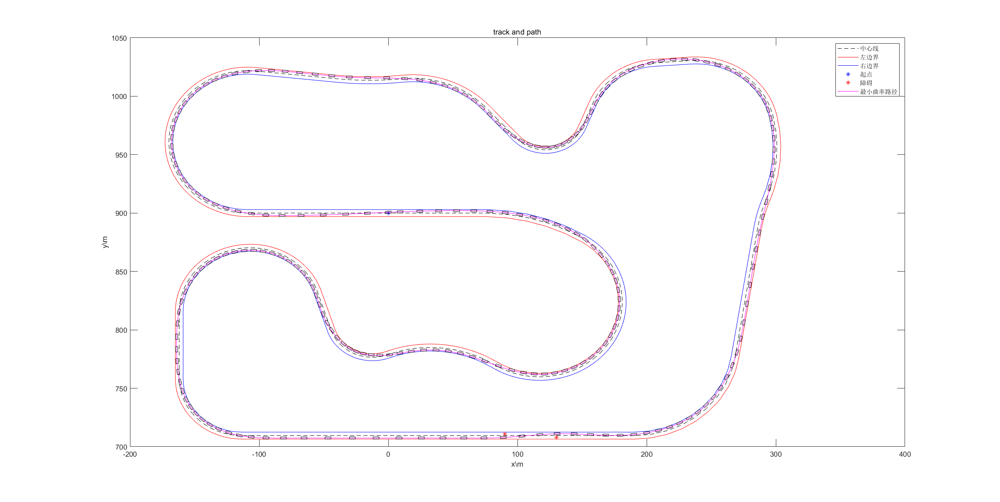
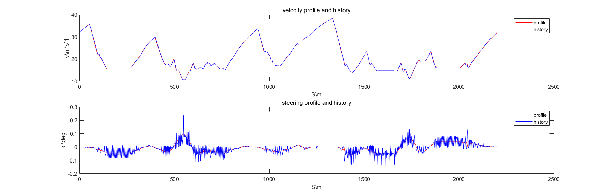

# Results  

    
	  
 

   
 

    
	  
 

   
  

# View result  
to view result, run main_prog.m  
# Update logs  
- 20200804 path optimization function added  
- 20200806 velocity profile generation function added  
- 20200807 initial velocity constrain added
- 20200807 MPC control result attached, code unpublished yet(same method as https://github.com/guannan-he/codes_of_self_driving_cars_University_of_Toronto/tree/master/part_1_model_6_lesson_4)
# Current issues  
- 20200806 velocity profile didn't consider initial speed and speed at start is higher than speed at the end, which is impossible even for flying laps.  
solved  
- 20200806 MPC control results a funny behaviour (see./pics/Houston_we_have_a_problem.png for detail), may be the heading reference problem, use the heading vector as reference may solve the problem.  
solved use accumulated heading angle
