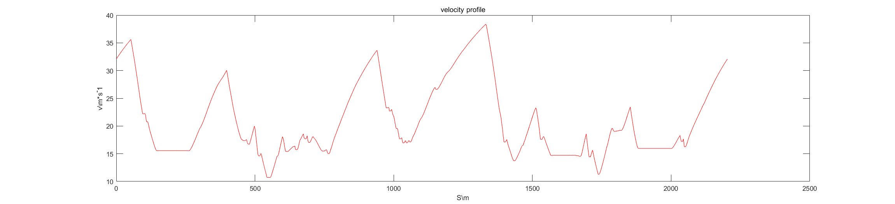

# Results  

    
	  

  

    
	  

  
# Update logs  
- 20200804 path optimization function added  
- 20200806 velocity profile generation function added  
# Current issues  
- 20200806 velocity profile didn't consider initial speed and speed at start is higher than speed at the end, which is impossible even for flying laps.
